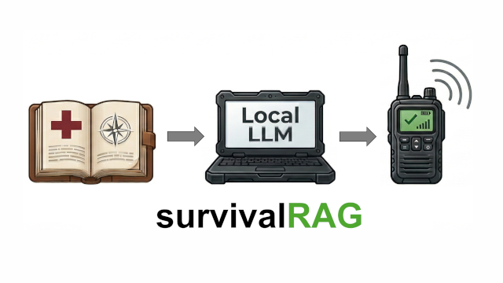

<p align="center">
  
</p>

# SurvivalRAG

An offline survival and medical knowledge base for local LLMs — designed to be queryable over Meshtastic mesh radio when the grid is down.

---

When Hurricane Helene hit in September 2024, it knocked out 4,562 cell sites across five states — the worst outage ever recorded. Communities in western North Carolina were isolated for weeks with no cell service, no internet, no way to call for help. After Hurricane Maria in 2017, Puerto Rico averaged 41 days without cell service. A third of the estimated 2,975 excess deaths were attributed to disrupted medical care. Twenty-six people died from drinking contaminated stream water — a preventable outcome if they'd had access to basic water safety information.

This pattern repeats in every major disaster. Infrastructure fails, information channels go dark, and people are left making life-or-death decisions — wound treatment, water purification, shelter, navigation — with no way to look anything up. The 72-hour self-sufficiency window that FEMA recommends turns out to be wildly optimistic.

[Meshtastic](https://meshtastic.org) is changing the communication side of this problem. It's an open-source mesh networking protocol that runs on cheap LoRa radios ($20–$50), requires no license, no cell towers, no internet — just devices talking to each other. It was deployed during Helene, the 2025 LA wildfires, and the Berlin blackout. Communities are building permanent mesh networks so they're not caught off guard again.

But Meshtastic only moves messages. It doesn't know anything. If you send a question over the mesh today, there's nothing on the other end to answer it.

**SurvivalRAG is that other end.** A curated, public domain knowledge base of survival and medical content — sourced from US military field manuals, FEMA guides, CDC guidelines, and other government publications — processed and structured for RAG retrieval against a local LLM. The goal is a plug-and-play system: connect it to your local model, connect it to your mesh node, and anyone on the network can send a survival or medical question and get a grounded, source-cited answer back.

No internet required. No subscriptions. No cloud. Just a knowledge base, a local model, and a radio.

## Quick Start

### Prerequisites

- [Docker Desktop](https://www.docker.com/products/docker-desktop/) (v4.0+) or Docker Engine with Docker Compose v2
- 16GB RAM minimum
- 20GB free disk space

### Launch

```bash
git clone https://github.com/bdkoeh/survivalRAG.git
cd survivalRAG
docker compose up
```

First build takes 10-20 minutes (downloads base images and bakes LLM models).
On first launch, the vector store is automatically built from pre-embedded chunks -- this adds ~30-60 seconds. Subsequent starts skip this step.

Once ready, open **http://localhost:8080** in your browser.

> The system is fully offline after the initial build -- no internet required at runtime.

## Hardware Requirements

| Resource | Minimum | Recommended |
|----------|---------|-------------|
| RAM | 16GB | 32GB |
| Disk | 20GB free | 30GB free |
| CPU | 4 cores | 8+ cores |
| GPU | Not required | NVIDIA GPU (Linux only) |

### Image Sizes

| Container | Size |
|-----------|------|
| survivalrag-app | ~1GB |
| survivalrag-ollama | ~7GB |
| **Total** | **~8GB** |

The Ollama image is large because it includes the bundled LLM models:
- **llama3.1:8b** (4.9GB) -- response generation
- **nomic-embed-text** (274MB) -- query embedding

## Configuration

Copy `.env.example` to `.env` and uncomment variables to override defaults:

```bash
cp .env.example .env
```

| Variable | Default | Description |
|----------|---------|-------------|
| `SURVIVALRAG_MODEL` | `llama3.1:8b` | LLM model for response generation |
| `OLLAMA_HOST` | `http://ollama:11434` | Ollama server URL |
| `SURVIVALRAG_MAX_CHUNKS` | `5` | Maximum chunks retrieved per query |
| `SURVIVALRAG_RELEVANCE_THRESHOLD` | `0.25` | Cosine similarity threshold |
| `SURVIVALRAG_RERANKER_MODEL` | `BAAI/bge-reranker-v2-m3` | Cross-encoder reranker model (set to `none` to disable) |

### Using an External Ollama Instance

To use a GPU-equipped machine on your network instead of the bundled Ollama container:

1. Run Ollama on the GPU machine: `ollama serve`
2. Ensure the required models are available: `ollama pull llama3.1:8b && ollama pull nomic-embed-text`
3. Set `OLLAMA_HOST` in your `.env` file:
   ```
   OLLAMA_HOST=http://192.168.1.100:11434
   ```
4. Start only the app container: `docker compose up app`

### Using a Different Model

Set `SURVIVALRAG_MODEL` in your `.env` file. The model must be available in your Ollama instance:

```
SURVIVALRAG_MODEL=mistral:7b
```

## GPU Acceleration

### Linux (NVIDIA)

1. Install the [NVIDIA Container Toolkit](https://docs.nvidia.com/datacenter/cloud-native/container-toolkit/latest/install-guide.html)
2. Start with the GPU override:
   ```bash
   docker compose -f docker-compose.yml -f docker-compose.gpu.yml up
   ```

### macOS (Apple Silicon)

Docker on macOS cannot access Apple Metal GPUs. For GPU acceleration on Mac:

1. Install Ollama natively: `brew install ollama`
2. Pull the required models: `ollama pull llama3.1:8b && ollama pull nomic-embed-text`
3. Start Ollama: `ollama serve`
4. Set `OLLAMA_HOST` in your `.env` file:
   ```
   OLLAMA_HOST=http://host.docker.internal:11434
   ```
5. Start only the app container: `docker compose up app`

## CLI Access

The CLI is available inside the app container via `docker exec`:

```bash
# Single query
docker exec -it survivalrag-app python cli.py ask "how to purify water"

# With category filter
docker exec -it survivalrag-app python cli.py ask --category medical "how to treat a burn"

# Interactive REPL
docker exec -it survivalrag-app python cli.py
```

## Building for Multiple Architectures

The default `docker compose build` builds images for your host architecture only.
To build images for both AMD64 and ARM64 (e.g., for distribution or M-series Macs + x86 servers):

```bash
# Create a multi-arch builder (one-time setup)
docker buildx create --name survivalrag-builder --use

# Build app image for both architectures
docker buildx build --platform linux/amd64,linux/arm64 -t survivalrag-app -f Dockerfile .

# Build Ollama image for both architectures
docker buildx build --platform linux/amd64,linux/arm64 -t survivalrag-ollama -f Dockerfile.ollama .
```

> **Note:** Multi-arch builds for the Ollama image are slow because models must be pulled during build for each architecture. The base images (`python:3.14-slim` and `ollama/ollama`) already support both AMD64 and ARM64.

## Troubleshooting

| Problem | Solution |
|---------|----------|
| Build fails during model download | Ensure stable internet during `docker compose build` |
| "Ollama not available" in logs | Wait for Ollama health check to pass (up to 5 minutes on first start) |
| Very slow responses | Expected on CPU-only; see GPU Acceleration section |
| Port 8080 already in use | Change port mapping in docker-compose.yml: `"9090:8080"` |
| ChromaDB errors or missing vector store | Run `docker compose down && docker compose up --build` to rebuild |
| Out of disk space during build | Need 20GB+ free; clear Docker cache: `docker system prune` |

### Useful Commands

```bash
# Check container status and health
docker compose ps

# View logs
docker compose logs -f

# Rebuild after changes
docker compose build

# Stop and remove containers
docker compose down

# Check health endpoint
curl http://localhost:8080/api/health
```

## What's Included

| Component | Details |
|---|---|
| Source documents | 70 public domain PDFs + 226 Wikipedia medical articles (CC BY-SA 4.0) |
| Knowledge base | 29,786 chunks across 296 sources |
| Provenance manifests | Source URL, license, distribution statement per document |
| Document processing | Extraction, cleaning, section splitting -- 7,915+ sections |
| Chunking & embedding | Content-type-aware, benchmarked at 88% Recall@5 |
| Retrieval pipeline | Hybrid vector + BM25 search with cross-encoder reranking |
| Response generation | 3 modes: full, compact, ultra-short (~200 chars for mesh) |
| Evaluation framework | 156 golden queries with ground truth, 4-dimension scoring |
| Web UI | Gradio chat interface |
| CLI | Single query + interactive REPL |
| Docker deployment | Single-command `docker compose up` |

## What's In the Knowledge Base

All content is **public domain** (US government works) or **openly licensed** (CC BY, CC BY-SA, CC0). No copyrighted material. Every document has a YAML provenance manifest with source URL, license type, distribution statement, and verification date.

### Tier 1: Public Domain (70 sources)

**Survival & Field Skills**
- FM 21-76 — US Army Survival Manual
- FM 3-05.70 — Survival (shelter, water, food, navigation, firecraft, tools)
- FM 21-76-1 — Survival, Evasion, and Recovery (pocket guide)
- FEMA "Are You Ready?" Citizen Preparedness Guide

**Field Medicine**
- ST 31-91B — Special Forces Medical Handbook (400+ pages)
- FM 21-10 — Field Hygiene and Sanitation
- FM 4-25.11 — First Aid
- CDC disaster first aid, wound care, water treatment, and food safety guidelines

**Water, Food, Shelter**
- FM 21-10 sections on water purification
- FEMA emergency water and food storage guides
- USDA food safety guidelines

Plus 50+ additional documents covering cold weather operations, preventive medicine, nuclear preparedness, disease guidelines, and more.

### Tier 2: WikiMed — Wikipedia Medical Articles (226 sources, CC BY-SA 4.0)

Curated Wikipedia articles fetched via the MediaWiki API, filling gaps in the military-heavy Tier 1 corpus:

| Domain | Examples |
|--------|----------|
| Diseases & Infections | Cholera, Malaria, Dengue, Lyme disease, Rabies, Sepsis |
| Toxicology | Snakebite, Spider bite, Mushroom poisoning, Carbon monoxide |
| Environmental Medicine | Hypothermia, Altitude sickness, Heat stroke, Drowning |
| Medications | Ibuprofen, Aspirin, Epinephrine, Diphenhydramine |
| Trauma | Burns, Fractures, Pneumothorax, Crush syndrome |
| Mental Health | PTSD, Acute stress, Panic attacks, Sleep deprivation |
| Food & Foraging | Edible mushrooms, Cattails, Acorns, Entomophagy |
| Fire & Tools | Bow drill, Ferrocerium, Knots, Cordage |
| Shelter | Igloo, Quinzhee, Snow cave, Lean-to |
| Water | Solar disinfection, Desalination, Rainwater harvesting |

Each WikiMed chunk carries the Wikipedia revision ID, contributor attribution, and CC BY-SA 4.0 license in its metadata. To re-fetch or update the WikiMed content:

```bash
python -m pipeline.wikimed           # fetch, chunk, embed all articles
python -m pipeline.wikimed --resume  # skip already-processed articles
```

See `sources/manifests/` for the full list with provenance details.

## How It Works

```
Source PDFs → Extract & Clean → Split into Sections → Chunk by Content Type → Embed → Vector Store
Wikipedia  → MediaWiki API → Strip Markup → Chunk → Embed ↗                            ↓
                                                              User Query → Hybrid Search (Vector + BM25)
                                                                         → Cross-Encoder Reranking
                                                                         → Prompt Assembly → LLM → Cited Answer
```

1. **Document processing** — PDFs are extracted via Docling, cleaned, and split into logical sections. Wikipedia articles are fetched via MediaWiki API and stripped of wiki markup.
2. **Content-aware chunking** — Different strategies for procedures, reference tables, safety warnings, and general content (512-token chunks, never splits mid-step)
3. **Hybrid retrieval** — Vector similarity (ChromaDB) fused with BM25 keyword search via Reciprocal Rank Fusion (RRF), with optional category pre-filtering
4. **Cross-encoder reranking** — Fused results are re-scored by a cross-encoder model (BAAI/bge-reranker-v2-m3) for 15-40% precision improvement. Optional and configurable via env var.
5. **Safety-first prompting** — Safety warnings are surfaced before other context. When retrieved context is insufficient, the system says so instead of guessing
6. **Source citation** — Every answer cites which document the information came from

The system is LLM-agnostic (works with whatever local model you run via Ollama) and fully offline after initial setup.

## What This Is Not

- **Not a diagnostic tool.** This is a reference system, not a medical system.
- **Not a replacement for training.** It can recite the steps but it cannot teach the skill.
- **Not guaranteed accurate.** Small local LLMs can misinterpret context. That's why every answer includes citations — so you can verify against the source.

## Meshtastic Integration

SurvivalRAG is designed to be queryable over [Meshtastic](https://meshtastic.org) mesh radio. The pipeline already includes an `ultra` response mode that produces telegram-style answers under 200 characters — sized to fit within LoRa's 228-byte packet limit.

### How It Fits Together

```
Meshtastic Radio → meshtastic Python package → gen.answer(query, mode="ultra") → response text → Meshtastic Radio
```

The entire pipeline is a single function call. No HTTP API needed — import the modules directly.

### Minimal Bridge Example

```python
import meshtastic
import meshtastic.serial_interface

import pipeline.retrieve as retrieve
import pipeline.generate as gen

# Initialize the RAG pipeline (once at startup)
retrieve.init(chroma_path="./data/chroma")
gen.init()

interface = meshtastic.serial_interface.SerialInterface()

def on_receive(packet, interface):
    """Handle incoming mesh messages."""
    if "decoded" not in packet or "text" not in packet["decoded"]:
        return

    query = packet["decoded"]["text"]
    sender = packet.get("fromId")

    # Query the knowledge base in ultra mode (~200 chars, no citations)
    result = gen.answer(query_text=query, mode="ultra")
    response = result["response"]

    # Send the answer back over the mesh
    interface.sendText(response, destinationId=sender)

from pubsub import pub
pub.subscribe(on_receive, "meshtastic.receive.text")

# Keep running
import time
while True:
    time.sleep(1)
```

### Key Design Points

- **`ultra` mode** — System prompt enforces telegram-style phrasing under 200 characters. Token limit is 80. No citations are included (they'd waste bytes). This is what you want for mesh.
- **`compact` mode** — 512-token responses for higher-bandwidth scenarios (e.g., TCP-connected nodes, Wi-Fi backhaul). Includes citations.
- **No streaming needed** — Mesh messages are sent as complete packets, so use `gen.answer()` (blocking) rather than `gen.answer_stream()`.
- **Category filtering** — Pass `categories=["medical"]` to scope retrieval. Useful if you set up dedicated mesh channels per topic.
- **Refusal handling** — When no relevant chunks are found, `result["status"]` is `"refused"` and the response is a canned refusal message. Check this before sending to avoid confusing replies.

### Constraints to Plan For

| Constraint | Detail |
|-----------|--------|
| LoRa packet size | 228 bytes max per message. `ultra` mode stays under this. |
| Throughput | ~1 kbps on LoRa. One query-response cycle is fine; bulk queries will queue. |
| Inference latency | LLM generation takes 2-15 seconds depending on hardware. Consider sending a "thinking..." ack. |
| Channel management | Decide whether to listen on a dedicated channel or the default. A dedicated channel avoids noise. |
| Node filtering | You probably don't want to answer every message on the mesh — filter by channel or message prefix (e.g., messages starting with `?`). |

### Reference Projects

- [MESH-API](https://github.com/mr-tbot/mesh-api) — Meshtastic-to-LLM bridge (no knowledge base)
- [Radio-LLM](https://github.com/pham-tuan-binh/radio-llm) — LoRa radio to local LLM bridge
- [Meshtastic Python docs](https://meshtastic.org/docs/software/python/cli/) — `meshtastic` package reference

## Contributing

This is a community project and there's plenty of ways to help, even if you don't write code:

- **Content** — Finding and verifying public domain survival/medical documents
- **Data quality** — Improving OCR output, cleaning up formatting, fixing chunking issues
- **Code** — Retrieval pipeline, response generation, interfaces, deployment
- **Testing** — Running queries, evaluating answer quality, reporting issues
- **Documentation** — Making it easier for others to deploy and contribute
- **Translation** — Making the knowledge base accessible in more languages

If you're interested, open an issue or start a discussion.

## Project Structure

```
survivalRAG/
├── pipeline/               # Processing and retrieval pipeline
│   ├── extract.py          # PDF extraction (Docling + OCR fallback)
│   ├── clean.py            # Text cleaning
│   ├── split.py            # Section splitting
│   ├── classify.py         # LLM-based content classification
│   ├── chunk.py            # Content-aware chunking
│   ├── embed.py            # Ollama embedding wrapper (nomic-embed-text)
│   ├── ingest.py           # ChromaDB ingestion
│   ├── retrieve.py         # Hybrid search (vector + BM25 + RRF)
│   ├── rerank.py           # Cross-encoder reranking (optional)
│   ├── rewrite.py          # Multi-turn query rewriting
│   ├── prompt.py           # Prompt assembly with safety ordering
│   ├── generate.py         # LLM response generation (full/compact/ultra)
│   ├── evaluate.py         # 4-dimension evaluation framework
│   ├── wikimed.py          # WikiMed extraction pipeline
│   └── validate.py         # Dosage/measurement validation
├── web.py                  # Gradio web UI
├── cli.py                  # Click + Rich CLI
├── sources/
│   ├── manifests/          # YAML provenance manifest per document (292 files)
│   └── originals/          # Source PDFs (not in git, downloaded via scripts)
├── processed/
│   ├── chunks/             # Pre-embedded JSONL chunks (29,786 total)
│   ├── benchmark/          # Retrieval benchmark results
│   └── reports/            # Per-document classification reports
├── data/
│   ├── eval/               # Golden query datasets (156 queries + 20 refusal)
│   └── wikimed/            # WikiMed article list and config
├── docker-compose.yml      # Multi-container orchestration
├── docker-compose.gpu.yml  # NVIDIA GPU override
├── Dockerfile              # App container
├── Dockerfile.ollama       # Ollama container with bundled models
└── requirements.txt
```

## Requirements

- Python 3.11+
- [Ollama](https://ollama.ai) with `nomic-embed-text` (embeddings) and a chat model (default: `llama3.1:8b`)
- ~3GB disk for the processed knowledge base
- Optional: `sentence-transformers` for cross-encoder reranking (requires PyTorch)

## Evaluation

SurvivalRAG includes a 4-dimension evaluation framework with 156 golden queries (ground truth authored by Claude Opus 4.6) and 20 out-of-scope refusal queries:

| Dimension | What it measures | Threshold |
|-----------|-----------------|-----------|
| Retrieval Recall | Correct chunks retrieved for known queries | >= 85% |
| Hallucination Refusal | Out-of-scope queries correctly refused | 100% |
| Citation Faithfulness | Response claims verified against context | >= 90% |
| Safety Warning Surfacing | Safety-critical warnings shown when present | 100% |

```bash
python -m pipeline.evaluate                    # Run all dimensions
python -m pipeline.evaluate --suite retrieval  # Retrieval only (fast, no LLM)
```

## License

Code: [GNU General Public License v3.0](LICENSE)

Content:
- **Tier 1** (military manuals, FEMA, CDC, etc.): Public domain (17 U.S.C. 105) or CC0/CC BY
- **Tier 2** (Wikipedia medical articles): CC BY-SA 4.0 — attribution metadata is carried per-chunk
