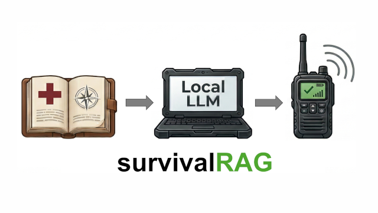

<p align="center">
  
</p>

# SurvivalRAG

An offline survival and medical knowledge base for local LLMs — designed to be queryable over Meshtastic mesh radio when the grid is down.

---

When Hurricane Helene hit in September 2024, it knocked out 4,562 cell sites across five states — the worst outage ever recorded. Communities in western North Carolina were isolated for weeks with no cell service, no internet, no way to call for help. After Hurricane Maria in 2017, Puerto Rico averaged 41 days without cell service. A third of the estimated 2,975 excess deaths were attributed to disrupted medical care. Twenty-six people died from drinking contaminated stream water — a preventable outcome if they'd had access to basic water safety information.

This pattern repeats in every major disaster. Infrastructure fails, information channels go dark, and people are left making life-or-death decisions — wound treatment, water purification, shelter, navigation — with no way to look anything up. The 72-hour self-sufficiency window that FEMA recommends turns out to be wildly optimistic.

[Meshtastic](https://meshtastic.org) is changing the communication side of this problem. It's an open-source mesh networking protocol that runs on cheap LoRa radios ($20-$50), requires no license, no cell towers, no internet — just devices talking to each other. It was deployed during Helene, the 2025 LA wildfires, and the Berlin blackout. Communities are building permanent mesh networks so they're not caught off guard again.

But Meshtastic only moves messages. It doesn't know anything. If you send a question over the mesh today, there's nothing on the other end to answer it.

**SurvivalRAG is that other end.** A curated, public domain knowledge base of survival and medical content — sourced from US military field manuals, FEMA guides, CDC guidelines, and other government publications — processed and structured for RAG retrieval against a local LLM. The goal is a plug-and-play system: connect it to your local model, connect it to your mesh node, and anyone on the network can send a survival or medical question and get a grounded, source-cited answer back.

No internet required. No subscriptions. No cloud. Just a knowledge base, a local model, and a radio.

## Quick Start (Local)

Get SurvivalRAG running on your machine. This is where you test queries, verify the knowledge base, and optionally connect a Meshtastic radio.

### Prerequisites

- Python 3.11+
- [Ollama](https://ollama.ai) installed and running
- 16GB RAM minimum (32GB recommended)
- ~10GB free disk space

### Setup

```bash
git clone https://github.com/bdkoeh/survivalRAG.git
cd survivalRAG

# Create virtual environment and install dependencies
python3 -m venv venv
source venv/bin/activate
pip install -r requirements.txt

# Pull the required models
ollama pull llama3.1:8b       # Response generation (4.9GB)
ollama pull nomic-embed-text  # Query embedding (274MB)
```

### Build the Vector Store

The knowledge base ships as pre-embedded chunks. On first run, build the vector store index:

```bash
python -c "
from pipeline.ingest import ingest_directory, get_collection
collection = get_collection('data/chroma')
ingest_directory('processed/chunks', collection=collection)
"
```

This takes about 30-60 seconds and creates the `data/chroma/` directory. You only need to do this once.

### Run

**Web UI:**

```bash
python web.py
```

Open **http://localhost:7860** in your browser.

**CLI:**

```bash
# Single query
python cli.py ask "how to purify water"

# With category filter
python cli.py ask --category medical "how to treat a burn"

# Interactive REPL
python cli.py
```

### Using a Different Model

Any Ollama chat model works. Set the environment variable before starting:

```bash
SURVIVALRAG_MODEL=qwen2.5:7b python web.py
SURVIVALRAG_MODEL=mistral:7b python cli.py
```

### Optional: Cross-Encoder Reranking

Improves retrieval precision 15-40% by re-scoring results with a cross-encoder model. Requires PyTorch:

```bash
pip install sentence-transformers
```

The reranker activates automatically once installed. Disable it with `SURVIVALRAG_RERANKER_MODEL=none`.

## Package for Distribution (Docker)

Once you've verified everything works locally, package SurvivalRAG as portable Docker images. These images contain everything — the app, the knowledge base, and the LLM models. No internet required to run them.

The idea: build once on a machine with internet, then distribute the images on flash drives. In an emergency, anyone with Docker can plug in the drive and have a working system in minutes.

### Build the Images

```bash
docker compose build
```

This takes 10-20 minutes on first build. It bakes the LLM models directly into the Ollama image so no downloads are needed at runtime.

| Image | Size | Contents |
|-------|------|----------|
| survivalrag-app | ~1GB | App, knowledge base, vector store |
| survivalrag-ollama | ~7GB | Ollama + llama3.1:8b + nomic-embed-text |
| **Total** | **~8GB** | Everything needed to run offline |

### Export to Flash Drive

```bash
# Save both images to a single file
docker save survivalrag-ollama survivalrag-app | gzip > survivalrag-images.tar.gz

# Copy to flash drive (along with docker-compose.yml and .env.example)
cp survivalrag-images.tar.gz /mnt/usb/
cp docker-compose.yml /mnt/usb/
cp .env.example /mnt/usb/
```

The compressed archive is roughly 5-6GB. A 16GB flash drive has room for it plus documentation.

### Multi-Architecture Builds

To build images that run on both Intel/AMD and ARM machines (e.g., Raspberry Pi, M-series Macs):

```bash
docker buildx create --name survivalrag-builder --use
docker buildx build --platform linux/amd64,linux/arm64 -t survivalrag-app -f Dockerfile .
docker buildx build --platform linux/amd64,linux/arm64 -t survivalrag-ollama -f Dockerfile.ollama .
```

## Deploy from Flash Drive

These are the instructions for the person receiving the flash drive. They need Docker installed — nothing else.

### Prerequisites

- [Docker Desktop](https://www.docker.com/products/docker-desktop/) (Windows/Mac) or Docker Engine (Linux)
- 16GB RAM minimum

### Steps

```bash
# 1. Load the images from the flash drive
docker load < /mnt/usb/survivalrag-images.tar.gz

# 2. Copy the compose file to a working directory
mkdir ~/survivalrag && cd ~/survivalrag
cp /mnt/usb/docker-compose.yml .

# 3. Start
docker compose up
```

Open **http://localhost:8080** in a browser. That's it.

On first launch, the vector store builds automatically from the pre-embedded chunks (~30-60 seconds). Subsequent starts skip this step.

> No internet is required at any point. Everything is in the images.

### GPU Acceleration (Linux with NVIDIA)

If the machine has an NVIDIA GPU and the [NVIDIA Container Toolkit](https://docs.nvidia.com/datacenter/cloud-native/container-toolkit/latest/install-guide.html):

```bash
# Also copy the GPU override file to the flash drive during packaging
docker compose -f docker-compose.yml -f docker-compose.gpu.yml up
```

### GPU Acceleration (macOS Apple Silicon)

Docker on macOS cannot access Apple Metal GPUs. For GPU acceleration on Mac, install Ollama natively and point the app container at it:

```bash
brew install ollama
ollama pull llama3.1:8b && ollama pull nomic-embed-text
ollama serve

# In another terminal:
OLLAMA_HOST=http://host.docker.internal:11434 docker compose up app
```

## Configuration

Copy `.env.example` to `.env` and uncomment variables to override defaults:

```bash
cp .env.example .env
```

| Variable | Default | Description |
|----------|---------|-------------|
| `SURVIVALRAG_MODEL` | `llama3.1:8b` | LLM model for response generation |
| `OLLAMA_HOST` | `http://ollama:11434` | Ollama server URL |
| `SURVIVALRAG_MAX_CHUNKS` | `5` | Maximum chunks retrieved per query |
| `SURVIVALRAG_RELEVANCE_THRESHOLD` | `0.25` | Cosine similarity threshold |
| `SURVIVALRAG_RERANKER_MODEL` | `BAAI/bge-reranker-v2-m3` | Cross-encoder reranker (set to `none` to disable) |

### Using an External Ollama Instance

To use a GPU-equipped machine on your network:

1. Run Ollama on the GPU machine: `ollama serve`
2. Pull the required models: `ollama pull llama3.1:8b && ollama pull nomic-embed-text`
3. Set `OLLAMA_HOST=http://192.168.1.100:11434` in your `.env` file
4. Start only the app container: `docker compose up app`

## Meshtastic Integration

SurvivalRAG includes a built-in Meshtastic mesh radio bridge. Anyone on the mesh network can send a query prefixed with `?` and receive a multi-part response split across radio messages, respecting LoRa's 233-byte packet limit.

### How It Works

```
Phone/Radio → "?how to purify water" → Meshtastic Mesh
    → SurvivalRAG Bridge (listens on configured channel)
    → RAG Pipeline (retrieve → generate in compact mode)
    → Split response into 200-byte parts with [1/3] [2/3] [3/3] numbering
    → Send parts back over mesh with delay between each
```

### Running the Bridge

**Local:**

```bash
# Plug in your Meshtastic radio via USB, then:
MESHTASTIC_ENABLED=true python meshtastic_main.py
```

**Docker (with USB radio passthrough):**

```bash
docker compose --profile meshtastic up
```

### Configuration

| Variable | Default | Description |
|----------|---------|-------------|
| `MESHTASTIC_ENABLED` | `false` | Enable/disable the bridge |
| `MESHTASTIC_CONNECTION` | `serial` | `serial`, `serial:/dev/ttyACM0`, or `tcp://host:port` |
| `MESHTASTIC_CHANNEL` | `0` | Channel index to listen/send on (0-7) |
| `MESHTASTIC_TRIGGER` | `?` | Message prefix that triggers queries |
| `MESHTASTIC_MAX_PARTS` | `5` | Maximum message parts per response (3-7) |
| `MESHTASTIC_CHUNK_DELAY` | `2.0` | Seconds between sending parts |
| `MESHTASTIC_RESPONSE_MODE` | `compact` | RAG response mode (`compact`, `ultra`, `full`) |
| `MESHTASTIC_BOT_PREFIX` | `[RAG]` | Prefix on outgoing messages (prevents bot loops) |

### Design Details

- **Message splitting** -- Responses are split at sentence boundaries (fallback to word boundaries). Each part includes a `[i/n]` suffix so recipients know the total and can identify missing parts.
- **Safety warnings first** -- If the query triggers safety warnings from the source material, they appear in part 1. If only one part arrives, it's the warning.
- **Deduplication** -- The mesh can deliver the same packet via multiple paths. The bridge deduplicates by packet ID.
- **Concurrency** -- Queries are serialized (one at a time) to prevent OOM on constrained hardware. Additional queries get a "Busy, try again shortly" response.
- **Bot loop prevention** -- Outgoing messages are prefixed with `[RAG]`. Incoming messages starting with that prefix are ignored. The bridge also ignores its own node ID.

### Constraints

| Constraint | Detail |
|-----------|--------|
| Packet size | 233 bytes max. Parts are capped at 200 bytes (194 content + 6 for `[i/n]`). |
| Throughput | ~1 kbps on LoRa. A 5-part response takes ~10 seconds to transmit. |
| Inference latency | LLM generation takes 2-15 seconds. A "Thinking..." ack is sent immediately. |
| Range | Depends on terrain and antenna. Typical: 1-5 km urban, 10-30 km line-of-sight. |

### Reference Projects

- [MESH-API](https://github.com/mr-tbot/mesh-api) -- Meshtastic-to-LLM bridge with configurable chunking
- [Radio-LLM](https://github.com/pham-tuan-binh/radio-llm) -- LoRa radio to local LLM bridge
- [MeshasticBot](https://github.com/vitug/MeshasticBot) -- Part-numbering implementation reference
- [Meshtastic Python docs](https://meshtastic.org/docs/software/python/cli/) -- `meshtastic` package reference

## Troubleshooting

| Problem | Solution |
|---------|----------|
| `ModuleNotFoundError` | Activate the venv: `source venv/bin/activate` |
| Ollama not running | Start it: `ollama serve` |
| Model not found | Pull it: `ollama pull llama3.1:8b` |
| No vector store | Run the build step from Quick Start |
| Very slow responses | Expected on CPU-only; use a GPU or a smaller model |
| Port already in use | Web UI uses 7860 (local) or 8080 (Docker) |
| Docker build fails | Ensure stable internet during `docker compose build` |
| Meshtastic "no device" | Check USB connection: `ls /dev/ttyUSB* /dev/ttyACM*` |

### Useful Commands

```bash
# Check health (local)
curl http://localhost:7860/api/health

# Check health (Docker)
curl http://localhost:8080/api/health

# Docker logs
docker compose logs -f

# Docker rebuild
docker compose build

# Run evaluation suite
python -m pipeline.evaluate
```

## What's Included

| Component | Details |
|---|---|
| Source documents | 70 public domain PDFs + 226 Wikipedia medical articles (CC BY-SA 4.0) |
| Knowledge base | 29,786 chunks across 296 sources |
| Provenance manifests | Source URL, license, distribution statement per document |
| Document processing | Extraction, cleaning, section splitting -- 7,915+ sections |
| Chunking & embedding | Content-type-aware, benchmarked at 88% Recall@5 |
| Retrieval pipeline | Hybrid vector + BM25 search with cross-encoder reranking |
| Response generation | 3 modes: full, compact, ultra-short (~200 chars for mesh) |
| Evaluation framework | 156 golden queries with ground truth, 4-dimension scoring |
| Web UI | Gradio chat interface |
| CLI | Single query + interactive REPL |
| Meshtastic bridge | Multi-part mesh radio interface with message splitting |

## What's In the Knowledge Base

All content is **public domain** (US government works) or **openly licensed** (CC BY, CC BY-SA, CC0). No copyrighted material. Every document has a YAML provenance manifest with source URL, license type, distribution statement, and verification date.

### Tier 1: Public Domain (70 sources)

**Survival & Field Skills**
- FM 21-76 -- US Army Survival Manual
- FM 3-05.70 -- Survival (shelter, water, food, navigation, firecraft, tools)
- FM 21-76-1 -- Survival, Evasion, and Recovery (pocket guide)
- FEMA "Are You Ready?" Citizen Preparedness Guide

**Field Medicine**
- ST 31-91B -- Special Forces Medical Handbook (400+ pages)
- FM 21-10 -- Field Hygiene and Sanitation
- FM 4-25.11 -- First Aid
- CDC disaster first aid, wound care, water treatment, and food safety guidelines

**Water, Food, Shelter**
- FM 21-10 sections on water purification
- FEMA emergency water and food storage guides
- USDA food safety guidelines

Plus 50+ additional documents covering cold weather operations, preventive medicine, nuclear preparedness, disease guidelines, and more.

### Tier 2: WikiMed -- Wikipedia Medical Articles (226 sources, CC BY-SA 4.0)

Curated Wikipedia articles fetched via the MediaWiki API, filling gaps in the military-heavy Tier 1 corpus:

| Domain | Examples |
|--------|----------|
| Diseases & Infections | Cholera, Malaria, Dengue, Lyme disease, Rabies, Sepsis |
| Toxicology | Snakebite, Spider bite, Mushroom poisoning, Carbon monoxide |
| Environmental Medicine | Hypothermia, Altitude sickness, Heat stroke, Drowning |
| Medications | Ibuprofen, Aspirin, Epinephrine, Diphenhydramine |
| Trauma | Burns, Fractures, Pneumothorax, Crush syndrome |
| Mental Health | PTSD, Acute stress, Panic attacks, Sleep deprivation |
| Food & Foraging | Edible mushrooms, Cattails, Acorns, Entomophagy |
| Fire & Tools | Bow drill, Ferrocerium, Knots, Cordage |
| Shelter | Igloo, Quinzhee, Snow cave, Lean-to |
| Water | Solar disinfection, Desalination, Rainwater harvesting |

Each WikiMed chunk carries the Wikipedia revision ID, contributor attribution, and CC BY-SA 4.0 license in its metadata. To re-fetch or update the WikiMed content:

```bash
python -m pipeline.wikimed           # fetch, chunk, embed all articles
python -m pipeline.wikimed --resume  # skip already-processed articles
```

See `sources/manifests/` for the full list with provenance details.

## How It Works

```
Source PDFs → Extract & Clean → Split into Sections → Chunk by Content Type → Embed → Vector Store
Wikipedia  → MediaWiki API → Strip Markup → Chunk → Embed ↗                            ↓
                                                              User Query → Hybrid Search (Vector + BM25)
                                                                         → Cross-Encoder Reranking
                                                                         → Prompt Assembly → LLM → Cited Answer
```

1. **Document processing** -- PDFs are extracted via Docling, cleaned, and split into logical sections. Wikipedia articles are fetched via MediaWiki API and stripped of wiki markup.
2. **Content-aware chunking** -- Different strategies for procedures, reference tables, safety warnings, and general content (512-token chunks, never splits mid-step)
3. **Hybrid retrieval** -- Vector similarity (ChromaDB) fused with BM25 keyword search via Reciprocal Rank Fusion (RRF), with optional category pre-filtering
4. **Cross-encoder reranking** -- Fused results are re-scored by a cross-encoder model (BAAI/bge-reranker-v2-m3) for 15-40% precision improvement. Optional and configurable via env var.
5. **Safety-first prompting** -- Safety warnings are surfaced before other context. When retrieved context is insufficient, the system says so instead of guessing
6. **Source citation** -- Every answer cites which document the information came from

The system is LLM-agnostic (works with whatever local model you run via Ollama) and fully offline after initial setup.

## What This Is Not

- **Not a diagnostic tool.** This is a reference system, not a medical system.
- **Not a replacement for training.** It can recite the steps but it cannot teach the skill.
- **Not guaranteed accurate.** Small local LLMs can misinterpret context. That's why every answer includes citations -- so you can verify against the source.

## Evaluation

SurvivalRAG includes a 4-dimension evaluation framework with 156 golden queries (ground truth authored by Claude Opus 4.6) and 20 out-of-scope refusal queries:

| Dimension | What it measures | Threshold |
|-----------|-----------------|-----------|
| Retrieval Recall | Correct chunks retrieved for known queries | >= 85% |
| Hallucination Refusal | Out-of-scope queries correctly refused | 100% |
| Citation Faithfulness | Response claims verified against context | >= 90% |
| Safety Warning Surfacing | Safety-critical warnings shown when present | 100% |

```bash
python -m pipeline.evaluate                    # Run all dimensions
python -m pipeline.evaluate --suite retrieval  # Retrieval only (fast, no LLM)
```

## Project Structure

```
survivalRAG/
├── pipeline/                   # Processing and retrieval pipeline
│   ├── extract.py              # PDF extraction (Docling + OCR fallback)
│   ├── clean.py                # Text cleaning
│   ├── split.py                # Section splitting
│   ├── classify.py             # LLM-based content classification
│   ├── chunk.py                # Content-aware chunking
│   ├── embed.py                # Ollama embedding wrapper (nomic-embed-text)
│   ├── ingest.py               # ChromaDB ingestion
│   ├── retrieve.py             # Hybrid search (vector + BM25 + RRF)
│   ├── rerank.py               # Cross-encoder reranking (optional)
│   ├── rewrite.py              # Multi-turn query rewriting
│   ├── prompt.py               # Prompt assembly with safety ordering
│   ├── generate.py             # LLM response generation (full/compact/ultra)
│   ├── meshtastic_bridge.py    # Meshtastic mesh radio bridge
│   ├── evaluate.py             # 4-dimension evaluation framework
│   ├── wikimed.py              # WikiMed extraction pipeline
│   └── validate.py             # Dosage/measurement validation
├── web.py                      # Gradio web UI
├── cli.py                      # Click + Rich CLI
├── meshtastic_main.py          # Meshtastic bridge entry point
├── sources/
│   ├── manifests/              # YAML provenance manifest per document (292 files)
│   └── originals/              # Source PDFs (not in git, downloaded via scripts)
├── processed/
│   ├── chunks/                 # Pre-embedded JSONL chunks (29,786 total)
│   ├── benchmark/              # Retrieval benchmark results
│   └── reports/                # Per-document classification reports
├── data/
│   ├── eval/                   # Golden query datasets (156 queries + 20 refusal)
│   └── wikimed/                # WikiMed article list and config
├── tests/                      # Unit tests
├── docker-compose.yml          # Multi-container orchestration
├── docker-compose.gpu.yml      # NVIDIA GPU override
├── Dockerfile                  # App container
├── Dockerfile.ollama           # Ollama container with bundled models
└── requirements.txt
```

## Contributing

This is a community project and there's plenty of ways to help, even if you don't write code:

- **Content** -- Finding and verifying public domain survival/medical documents
- **Data quality** -- Improving OCR output, cleaning up formatting, fixing chunking issues
- **Code** -- Retrieval pipeline, response generation, interfaces, deployment
- **Testing** -- Running queries, evaluating answer quality, reporting issues
- **Documentation** -- Making it easier for others to deploy and contribute
- **Translation** -- Making the knowledge base accessible in more languages

If you're interested, open an issue or start a discussion.

## License

Code: [GNU General Public License v3.0](LICENSE)

Content:
- **Tier 1** (military manuals, FEMA, CDC, etc.): Public domain (17 U.S.C. 105) or CC0/CC BY
- **Tier 2** (Wikipedia medical articles): CC BY-SA 4.0 -- attribution metadata is carried per-chunk
